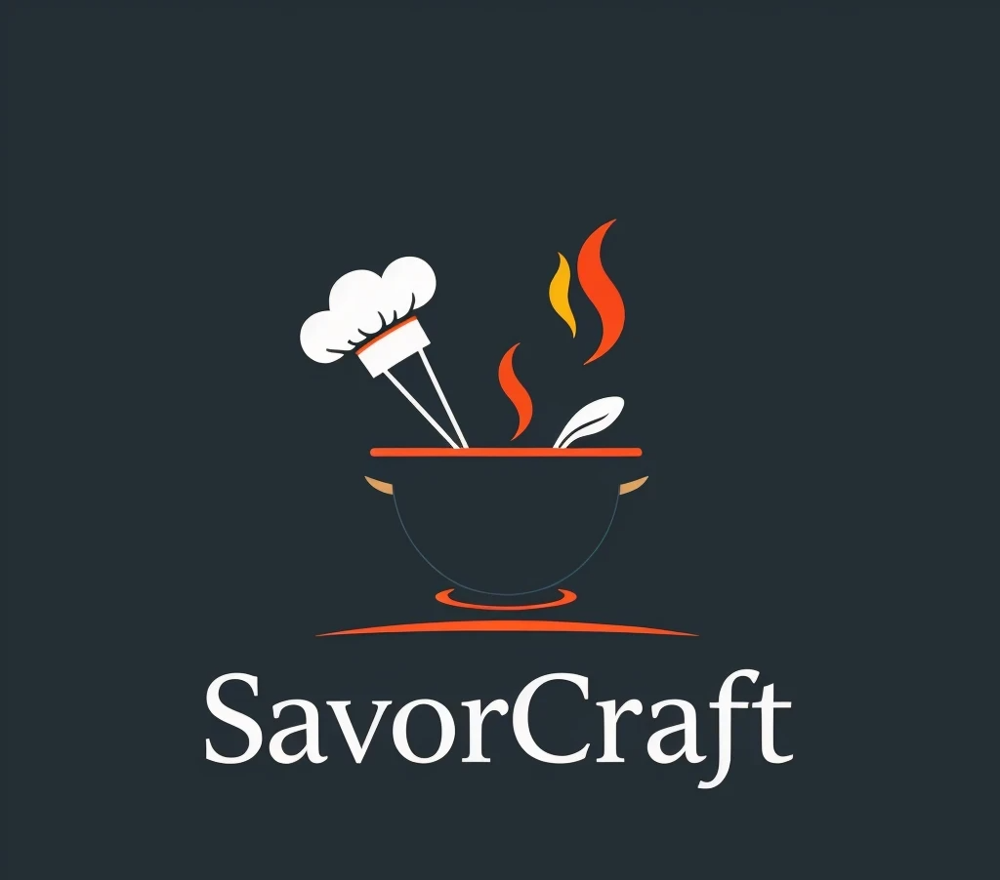

# 🍽️ SavorCraft – Curated Flavors, Crafted Simplicity

<table>
  <tr>
    <td width="40%">
      
    </td>
    <td width="60%">
      Welcome to <strong>SavorCraft</strong> — a sleek, fully responsive recipe website thoughtfully crafted using <strong>HTML5</strong>, <strong>CSS3</strong>, and <strong>Vanilla JavaScript</strong>. This project demonstrates my front-end development expertise by delivering a visually appealing, user-friendly experience that invites users to explore, enjoy, and be inspired by a curated collection of culinary creations.
    </td>
  </tr>
</table>

---

## 🔍 Features

- 🎨 **Modern, Elegant UI** — Beautiful, minimalist design with polished visual aesthetics.
- 📱 **Fully Responsive Layout** — Optimized for desktops, tablets, and smartphones.
- 🍔 **Interactive Hamburger Menu** — JavaScript-powered toggle for mobile navigation.
- ⚡ **Lightweight & Fast** — Built without frameworks for quick loading and smooth performance.
- 🧠 **User-Focused Experience** — Clean navigation and semantic HTML for accessibility.
- 🧾 **Structured Recipe Pages** — Organized layouts for ingredients, steps, and tags.
- ❌ **Custom 404 Page** — Personalized error page for enhanced UX.

---

## 📄 Project Structure

- **index.html** — Main landing page introducing _SavorCraft_ and showcasing featured recipes.
- **about.html** — Provides information about the project and its purpose.
- **contact.html** — Contact form and details for user interaction.
- **recipes.html** — Displays a collection of all available recipes.
- **single-recipe.html** — Template page for viewing an individual recipe in detail.
- **tag-template.html** — Dynamically displays recipes filtered by selected tags.
- **tags.html** — Lists all recipe tags for category-based browsing.
- **404.html** — Custom not-found page for improved user experience.
- **CSS/main.css** — Core stylesheet for layout, colors, typography, and responsiveness.
- **CSS/normalize.css** — CSS reset to ensure consistent rendering across browsers.
- **js/app.js** — JavaScript to control the responsive hamburger menu and navigation toggle.
- **images/** — Contains project assets including logos, UI screenshots, recipe images, and favicons used throughout the site.
- **README.md** — Detailed documentation of the SavorCraft project.
- **LICENSE** — License file specifying usage rights (MIT).

---

## 🌐 Live Demo

👉 [View SavorCraft Live](https://chalitha-wickramasinghe.github.io/savorcraft/)

> Hosted with GitHub Pages — no frameworks, no fluff — just pure front-end craftsmanship.

---

## 📸 Screenshots

> _Add your screenshots here once you have them saved to `images/` folder_

- 

---

## 🛠️ Technologies Used

- **HTML5** – Semantic markup for structured, accessible content.
- **CSS3** – Responsive styling with Flexbox, media queries, and CSS variables.
- **JavaScript (Vanilla)** – Mobile menu functionality via DOM manipulation.
- **Git & GitHub** – Version control and deployment via GitHub Pages.

---

## ⚙️ How to Run

### ✅ Live Website:
Visit the project instantly:  
👉 [https://chalitha-wickramasinghe.github.io/savorcraft/](https://chalitha-wickramasinghe.github.io/savorcraft/)

### 🖥️ Run Locally:
1. Clone or download the repository.
2. Open `index.html` with any modern web browser.
3. No additional setup or dependencies required.

---

## 👨‍💻 Author

**Chalitha T. Wickramasingha**  

🔗 [GitHub](https://github.com/chalitha-wickramasinghe)  
🔗 [LinkedIn](https://www.linkedin.com/in/chalitha-t-wickramasingha)

---

## 📄 License

This project is open-source and available under the [MIT License](LICENSE).

---

> 🎯 _Savor simplicity. Craft flavor. Build experiences._  
> Thank you for visiting SavorCraft!
